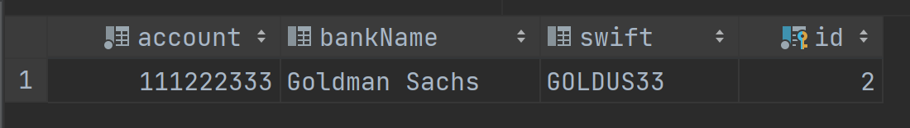

## Одна таблица для каждого класса с использованием соединений (JOIN) (4)
Схема наших классов остается неизменной:


А вот с БД произошли некоторые изменения:


Теперь при сохранении, например, экземпляра CreditCard Hibernate вставит две записи. В таблицу BILLING_DETAILS попадут свойства, объявленные в полях суперкласса BillingDetails, а значения полей подкласса CreaditCard будут записаны в таблицу CREDIT_CARD. Эти записи будут объединены общим первичным ключом.

Таким образом, схема была приведена в нормальное состояние. Эволюция схемы и определение ограничений целостности также осуществляются просто.
Внешние ключи позволяют представить полиморфную ассоциацию с конкретным подклассом.

Выполнив запрос
```SELECT bd FROM BillingDetails bd```

Мы увидим следующую картину
```
Hibernate: 
    select
        bd1_0.id,
        case 
            when bd1_2.id is not null 
                then 1 
            when bd1_1.id is not null 
                then 2 
            end,
            bd1_0.owner,
            bd1_1.account,
            bd1_1.bankName,
            bd1_1.swift,
            bd1_2.cardNumber,
            bd1_2.expMonth,
            bd1_2.expYear 
        from
            BillingDetails bd1_0 
        left join
            BankAccount bd1_1 
                on bd1_0.id=bd1_1.id 
        left join
            CreditCard bd1_2 
                on bd1_0.id=bd1_2.id
```
BillingDetails

CreditCard

BankAccount


Предложение CASE…WHEN позволяет Hibernate определить конкретный подкласс для каждой записи. В нем проверяется наличие либо отсутствие строк в таблицах подклассов CreditCard и BankAccount с помощью литералов.

Подобную стратегию будет весьма непросто реализовать вручную. Даже реализовать отчеты на основе произвольных запросов будет значительно сложнее.
Производительность также может оказаться неприемлемой для конкретного проекта, поскольку запросы потребуют соединения нескольких таблиц или многих последовательных операций чтения.