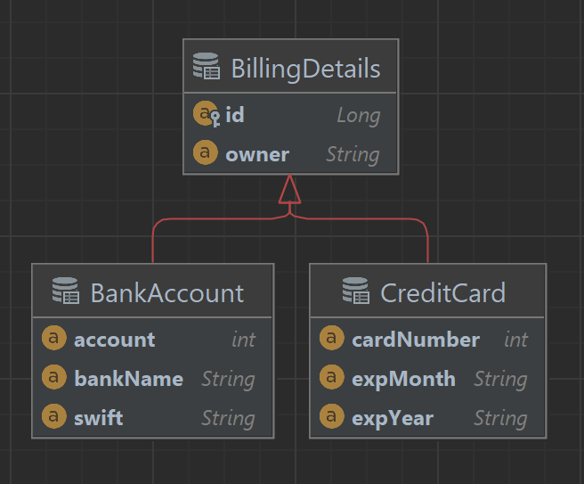
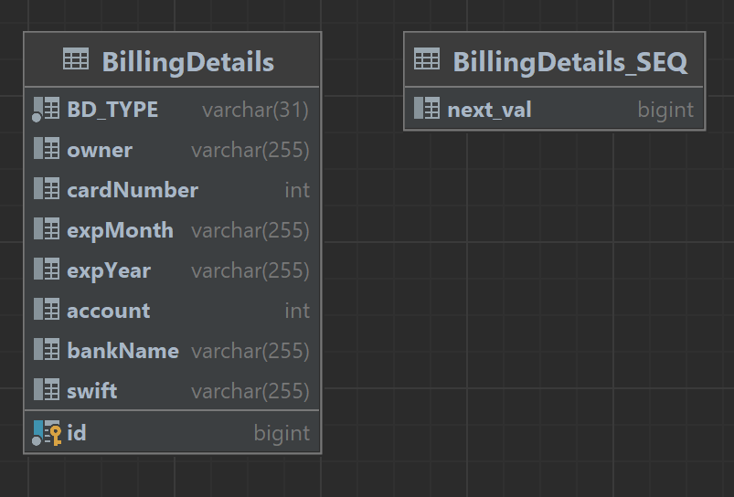
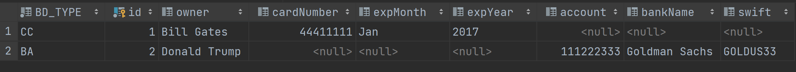

## Единая таблица для всей иерархии классов (3)

Иерархию классов можно целиком отобрать в одну таблицу. Она будет содержать столбцы для всех полей каждого класса иерархии. Для каждой записи конкретный подкласс будет определяться значением дополнительного столбца с селектором.

Наша схема теперь выглядит вот так:


Для создания отображения с одной таблицей необходимо использовать стратегию наследования SINGLE_TABLE.
Корневой класс будет отображен в таблицу BILLING_DETAILS. Для различения типов будет использован столбец селектора. Он не является полем сущности и создан только для нужд Hibernate. Его значением будут строки – “CC” или “BA”.
**ВАЖНО!** Если не указать столбец селектора в суперклассе явно – он получит название по умолчанию DTYPE и тип VARCHAR.

Каждый класс иерархии может указать свое значение селектора с помощью аннотации @DiscriminatorValue.
Не стоит пренебрегать явным указанием имени селектора: по умолчанию Hibernate будет использовать полное имя класса или имя сущности (зависит от того, используются ли файлы XML-Hibernate или xml-файлы JPA/аннотации).

Для проверки используем в методе main уже привычный запрос
```SELECT bd FROM BillingDetails bd```

В случае с единой таблицей запрос будет выглядеть так:
```
select
        bd1_0.id,
        bd1_0.BD_TYPE,
        bd1_0.owner,
        bd1_0.account,
        bd1_0.bankName,
        bd1_0.swift,
        bd1_0.cardNumber,
        bd1_0.expMonth,
        bd1_0.expYear 
    from
        BillingDetails bd1_0
```
> Если же запрос выполняется к конкретному подклассу – будет просто добавлена строка «where BD_TYPE = “CC”».

Вот как будет выглядеть отображение в единую таблицу:


>В случае, когда схема была унаследована, и добавить в нее столбец селектора невозможно, на помощь приходит аннотация @DiscriminatorFormula, которую необходимо добавить к родительскому классу. В нее необходимо передать выражение CASE...WHEN.
>```
>import org.hibernate.annotations.DiscriminatorFormula;
>
>import javax.persistence.*;
>
>@Entity
>@Table(name = "BILLING_DETAILS")
>@Inheritance(strategy = InheritanceType.SINGLE_TABLE)
>@DiscriminatorFormula("CASE WHEN CARD_NUMBER IS NOT NULL THEN 'CC' ELSE 'BA' END")
>public abstract class BillingDetails {
>
>    @Id
>    @GeneratedValue(strategy = GenerationType.SEQUENCE)
>    private int id;
>
>    //.................
>}
>```

Главным плюсом данной стратегии является **производительность**. Запросы (как полиморфные, так и неполиморфные) выполняются очень быстро и могут быть легко написаны вручную. Не приходится использовать соединения и объединения. Эволюция схемы также производится очень просто.

Однако, проблемы, сопровождающие эту стратегию, часто будут перевешивать ее преимущества.

Главной из них является целостность данных. Столбцы тех свойств, которые объявлены в подклассах, могут содержать NULL. В результате простая программная ошибка может привести к тому, что в базе данных окажется кредитная карта без номера или без срока действия.

Другой проблемой будет нарушение нормализации, а конкретно – третьей нормальной формы. В этом свете выгоды от повышенной производительности уже выглядят сомнительно. Ведь придется, как минимум, пожертвовать удобством сопровождения: в долгосрочной перспективе денормализованные схемы не сулят ничего хорошего.