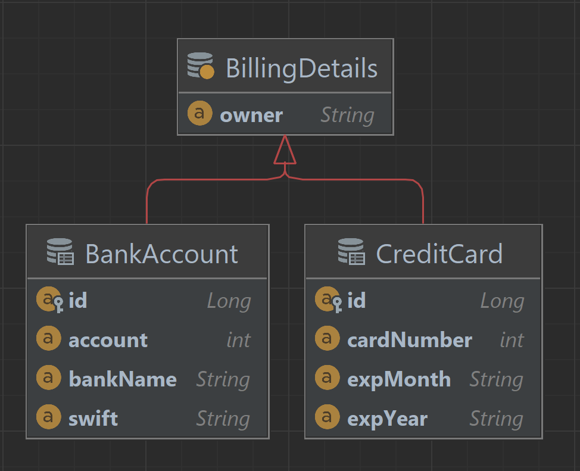
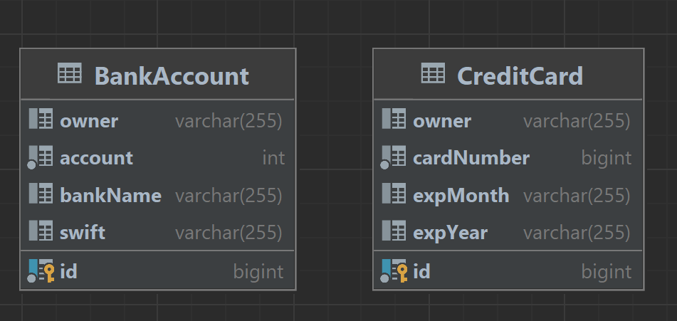

# Одна таблица для каждого класса (1)

Классы BankAccount и CreditCard наследуются от общего абстрактного предка BillingDetails. Как видно из схемы, несмотря на похожий функционал, их состояния существенно отличаются: для карты нам важны номер и срок действия, а для банковского счета – поля реквизитов.

Родительский класс хранит только общую для всех потомков информацию о владельце.
Кроме того, туда можно вынести, например, поле Id вместе с типом генерации (в данном случае мы обошлись без этого).

Схема БД для данной стратегии будет выглядеть так:


Полиморфизм в данном случае будет неявным. Каждый класс-потомок мы можем отразить с помощью аннотации Entity.

**ВАЖНО!** Свойства суперкласса по умолчанию будут проигнорированы. Чтобы сохранить их в таблицу конкретного подкласса, необходимо использовать аннотацию ```@MappedSuperClass```.

Главная проблема при использовании данной стратегии заключается в том, что использовать полиморфные ассоциации в полной мере будет невозможно: обычно они представлены в БД в виде доступа по внешнему ключу, а у нас попросту нет таблицы BILLING_DETAILS. А поскольку каждый объект BillingDetails будет в приложении связан с конкретным объектом User, то каждой из таблиц-«потомков» нужен будет внешний ключ, ссылающийся на таблицу USERS.

Кроме того, проблемой также будут и полиморфные запросы.

Попробуем выполнить запрос:
```SELECT bd FROM BillingDetails bd```

В данном случае он будет выполнен следующем образом:
```
Hibernate: 
    select
        ba1_0.id,
        ba1_0.account,
        ba1_0.bankName,
        ba1_0.owner,
        ba1_0.swift 
    from
        BankAccount ba1_0
Hibernate: 
    select
        cc1_0.id,
        cc1_0.cardNumber,
        cc1_0.expMonth,
        cc1_0.expYear,
        cc1_0.owner 
    from
        CreditCard cc1_0
```
Иными словами, для каждого конкретного подкласса Hibernate использует отдельный SELECT-запрос.

Другой важной проблемой при использовании данной стратегии будет сложность рефакторинга. Изменение названия полей в суперклассе вызовет необходимость изменения названий во многих таблицах и потребует ручного переименования. В случае, если в вашей схеме не 2 таблицы, а 50, это чревато большими временными затратами.

Этот подход возможно использовать только для верхушки иерархии классов, где:

* Полиморфизм не нужен (выборку для конкретного подкласса Hibernate будет выполнять в один запрос -> производительность будет высокой)
* Изменения в суперклассе не предвидятся.

Для приложения, где запросы будут ссылаться на родительский класс BillingDetails эта стратегия не подойдет.