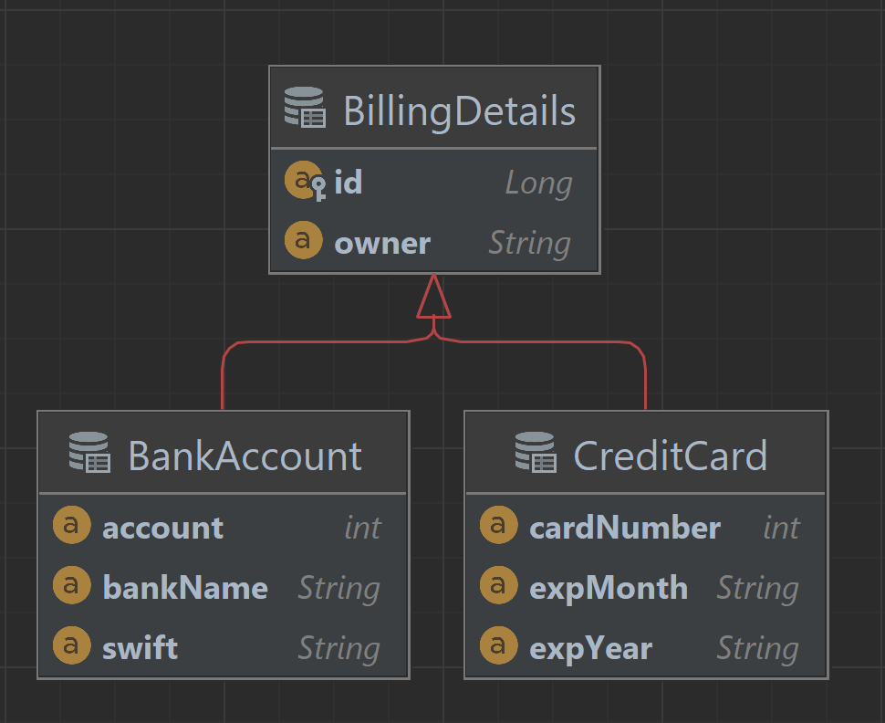
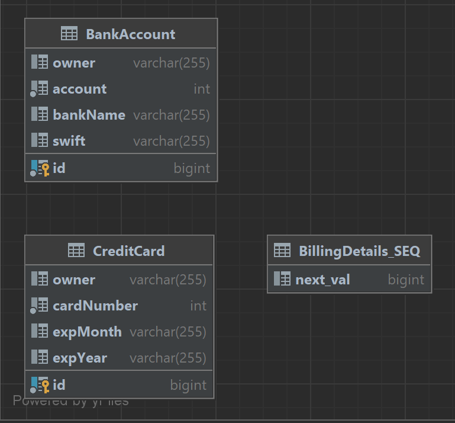
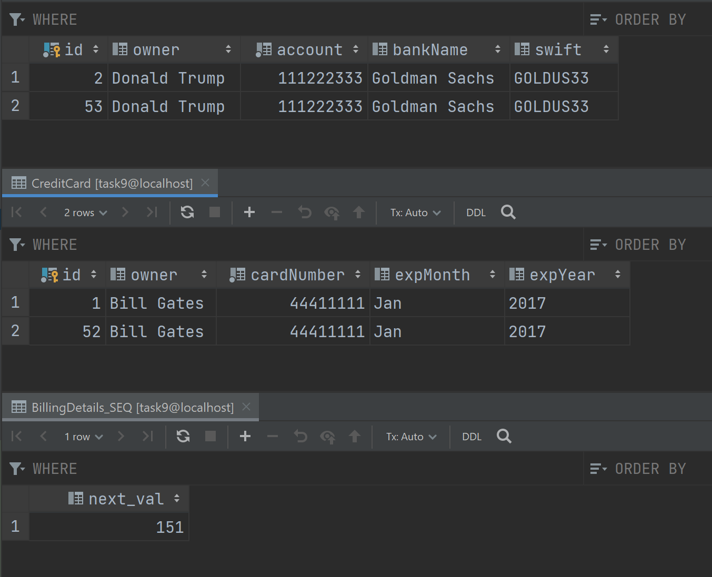

## Одна таблица для каждого класса с объединениями (UNION) (2)

В роли абстрактного класса вновь выступит BillingDetails.
Схема БД также останется без почти без изменений.

Новой также будет указанная над суперклассом аннотация ```@Inheritance``` с указанием выбранной стратегии TABLE_PER_CLASS.

**ВАЖНО!** В рамках данной стратегии наличие идентификатора в суперклассе является обязательным требованием (в первом примере мы обошлись без него).

**ВАЖНО!** Согласно стандарту JPA стратегия TABLE_PER_CLASS не является обязательной, поэтому другими реализациями может не поддерживаться.

Наша схема SQL по-прежнему ничего не знает о наследовании; между таблицами нет никаких отношений.

Главное преимущество данной стратегии можно увидеть, выполнив полиморфный запрос из предыдущего примера.
```SELECT bd FROM BillingDetails bd```

На сей раз результат будет выглядеть по-другому:
```
Hibernate: 
    select
        bd1_0.id,
        bd1_0.clazz_,
        bd1_0.owner,
        bd1_0.account,
        bd1_0.bankName,
        bd1_0.swift,
        bd1_0.cardNumber,
        bd1_0.expMonth,
        bd1_0.expYear 
    from
        (select
            id,
            owner,
            cardNumber,
            expMonth,
            expYear,
            null as account,
            null as bankName,
            null as swift,
            1 as clazz_ 
        from
            CreditCard 
        union
        all select
            id,
            owner,
            null as cardNumber,
            null as expMonth,
            null as expYear,
            account,
            bankName,
            swift,
            2 as clazz_ 
        from
            BankAccount
    ) bd1_0
```
Вот так выглядят записи внутри таблиц:


В данном случае Hibernate использует FROM, чтобы извлечь все экземпляры BillingDetails из всех таблиц подклассов. Таблицы объединяются с помощью UNION, а в промежуточный результат добавляются литералы (1 и 2). Литералы используются Hibernate для создания экземпляра правильного класса.

Объединение таблиц требует одинаковой структуры столбцов, поэтому вместо несуществующих столбцов были вставлены NULL (например, «null::varchar as bank_name» в credit_card – в таблице кредиток нет названия банка).

Другим важный преимуществом по сравнению с первой стратегией будет возможность использовать полиморфные ассоциации. Теперь можно будет без проблем отобразить ассоциации между классами User и BillingDetails.